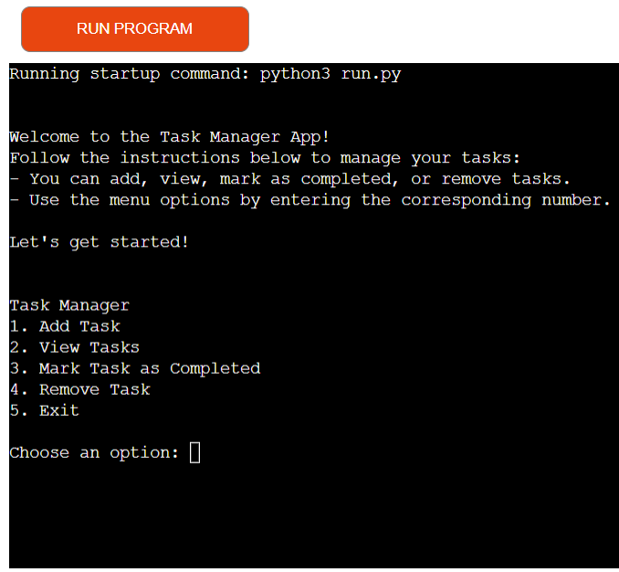

# Python Command Line Task Manager

This is a command-line-based task manager app written in Python. It allows users to organize and manage tasks efficiently by adding, viewing, completing, and removing tasks. The app ensures proper input validation for seamless functionality.

[live version of the project](https://taskm-388f9bd7b7c7.herokuapp.com/)


## Purpose and Benefits

The purpose of this application is to provide a lightweight, distraction-free tool to help users manage their tasks directly from the command line. It is particularly suitable for programmers, students, and individuals who prefer simplicity over feature-bloated applications.

### Key Benefits:
Helps users boost productivity by focusing on task completion.
Ensures clear organization of to-do lists, reducing mental clutter.
Operates entirely offline without requiring additional software or accounts.


## Features

- **Add a new task**: Allows you to add tasks with a description.
- **View all tasks**: Displays a list of all tasks with their status (Pending or Done).
- **Mark a task as completed**: Marks a specific task as done.
- **Remove a task**: Removes a specific task from the list.
- **Input validation**: Ensures proper inputs for task numbers and menu choices.
- **Exit the app**: Ends the program.

## How to Use

1. Clone or download the project.
2. Run the Python script:

   ```bash
   python3 run.py
3. Choose options from the menu to manage your tasks.
Menu Options:

   - **Add Task** - Add a new task with a description.
   - **View Tasks** - View all existing tasks.
   - **Mark Task** as Completed - Mark a task as completed.
   - **Remove Task** - Remove a task from the list.
   - **Exit** - Exit the task manager.

## Input Validation

This app incorporates validation to enhance user experience and prevent errors.
   ### Examples of Validation:
   - **Menu options**: Only numbers 1-5 are accepted.
   - **Empty Task descriptions**: Prevents adding tasks without a description.
   - **Task numbers**: Ensures selected tasks exist within the valid range.

## Testing
### Manual Testing Results
The following testing was performed manually:

1. Passed the code through the **PEP8 Linter**, confirming no errors or warnings:

      

2. Tested all features in a local terminal to verify expected behavior:
   - Adding tasks with valid and invalid inputs.
   - Viewing tasks with varying numbers of entries.
   - Completing tasks and verifying status updates.
   - Deleting tasks and checking updated lists.

### Testing Table
The table below summarizes the manual testing steps and outcomes for each feature:

| **Feature**            | **Input**                     | **Expected Outcome**                              | **Actual Outcome**                                |
|-------------------------|-------------------------------|--------------------------------------------------|--------------------------------------------------|
| Add Task               | Task description (e.g., `Buy milk`) | Task is added to the list                        | Task added successfully                          |
| View Tasks             | -                             | Displays all tasks                               | Tasks displayed correctly                        |
| Mark Task as Completed | Valid task number (e.g., `1`) | Marks task as completed                          | Task marked as done                              |
| Remove Task            | Valid task number (e.g., `1`) | Deletes the task                                 | Task removed successfully                        |
| Invalid Menu Option    | Non-numeric input (e.g., `abc`) | Displays error and prompts for valid input       | Error displayed, retry prompt shown             |
| Invalid Task Number    | Out-of-range task number (e.g., `10` for a list of 3 tasks) | Displays error and prompts for valid task number | Error displayed, retry prompt shown             |


## Accreditation
This project includes ideas adapted from the following external resources:

- [GeeksforGeeks Python Tutorials](https://www.geeksforgeeks.org/)
- [Real Python Command-Line Projects](https://realpython.com/)

## Future Improvements
Planned enhancements to add complexity and utility include:

- Task prioritization and deadline tracking.
- Saving tasks to a file for persistence.
- Advanced filtering and sorting options.
- Integration with graphical interfaces for wider accessibility.

## Purpose Visualized
### Flowchart
The following flowchart illustrates the app's logic:
 > Start → Display Menu → Perform Selected Action → Return to Menu → Exit

### Screenshots
#### 1. Menu Display
   
#### 2. Adding a Task
   
#### 2. Viweing a Task
   

# Installation

Ensure Python 3.x is installed. Then, download the repository, navigate to the project folder, and execute the script:

> python3 run.py
