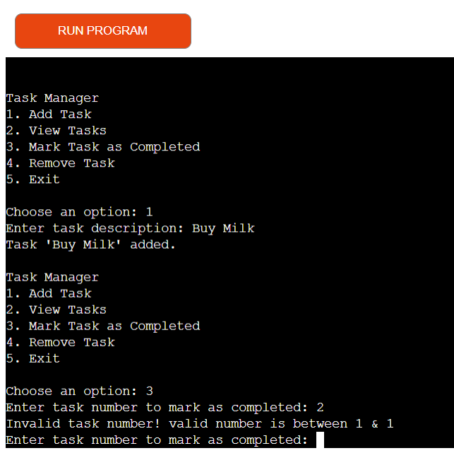

# Python Command Line Task Manager

This is a simple command-line based task manager app written in Python. It allows you to add tasks, view tasks, mark tasks as completed, and remove tasks. The app also includes input validation to ensure proper functioning and error handling.
> [Here is the live version of my project](https://taskm-388f9bd7b7c7.herokuapp.com/)

- 

## Features

- **Add a new task**: Allows you to add tasks with a description.
- **View all tasks**: Displays a list of all tasks with their status (Pending or Done).
- **Mark a task as completed**: Marks a specific task as done.
- **Remove a task**: Removes a specific task from the list.
- **Input validation**: Ensures proper inputs for task numbers and menu choices.
- **Exit the app**: Ends the program.

## Usage

1. Clone or download the project.
2. Run the Python script:

   ```bash
   python3 run.py
3. Choose options from the menu to manage your tasks.
Menu Options:

   - **Add Task** - Add a new task with a description.
   - **View Tasks** - View all existing tasks.
   - **Mark Task** as Completed - Mark a task as completed.
   - **Remove Task** - Remove a task from the list.
   - **Exit** - Exit the task manager.

# Input Validation

>The app ensures that:
   - Menu options are between 1 and 5.

      >
   - Task descriptions are not empty.
      > 
   - Task numbers are valid (i.e., within the range of available tasks).
      > 

# Testing

>I have manually tested this project by doing the following:

- Passed the code through PEP8 linter and confirmed there are no problems.
- Tested in my local terminal. 

# Validator Tasting
- PEP8
 - No error were returned

 - 


# Installation

Make sure you have Python 3.x installed. 

Once Python is installed, download the script and run it as described above.

# Future Improvements

- Add task priority or deadlines.
- Save tasks to a file for persistence.
- Improve task filtering and sorting options.